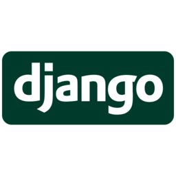

# Welcome, My name is Yo Wook! :wave:
:eyes: Witness the every day development of a developer :eyes:

 

### 🎓Student of  **Sogang University** 🎓 
(Soon to be) :man_student: Bachelor in  *Global Korean Studies* &   *German Culture*

 

## :bow_and_arrow: Aiming to be fullstack developer
### :computer: Currently Working With:
-  HTML5 &  CSS3 &  JavaScript
-  React 
-  Node.js 
-  Python &  Django
-  C

### 🎯 Current Goal
- Completing CS50x course :runner:
- Contributing to Open Source

### :dancers: Member of
- [Zero To Mastery Community](https://github.com/zero-to-mastery) 
- [CS50x Community](https://github.com/cs50)
- Likelion Sogang (Year 9)

### :fountain_pen: Visit My Tech Blog: [Koowoy Devs](https://uk960214.github.io/)

### Interested in
- :clapper: Movies & Dramas
- :musical_note: Music & Singing
- :man_cook: Food & Cooking
- :cocktail: Cocktails

